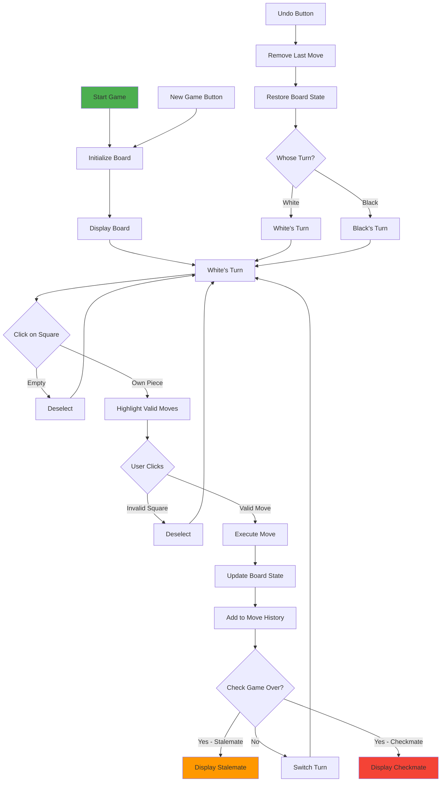
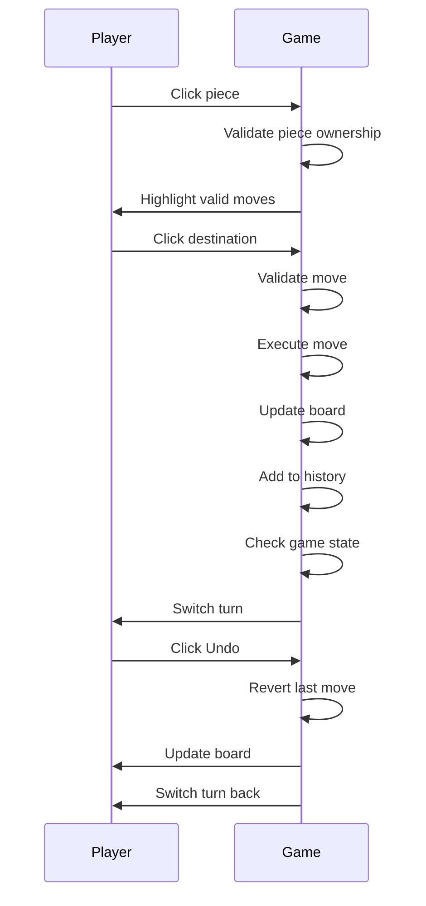

# Chess Game Technical Specification

## Project Overview

**Project Name:** GitHub Chess  
**Project Type:** Web-based 2-player chess game  
**Core Functionality:** A local 2-player chess game with full rules, move history, and undo functionality, deployable on GitHub Pages  
**Target Users:** Two players on the same device who want to play chess

---

## Technical Stack

- **HTML5** - Game structure and canvas
- **CSS3** - Styling and responsive design
- **JavaScript (ES6+)** - Game logic
- **Chess.js** - Chess move validation library
- **Chessboard.js** - UI component for chess board
- **GitHub Pages** - Free hosting deployment

---

## Game Features

### Core Features
1. **Full Chess Rules**
   - All piece movements (King, Queen, Rook, Bishop, Knight, Pawn)
   - Castling (kingside and queenside)
   - En passant capture
   - Pawn promotion (Queen default)
   - Check and checkmate detection
   - Stalemate detection

2. **Game Controls**
   - Click to select piece
   - Click to move piece
   - Valid move highlighting
   - Last move highlighting

3. **Move History**
   - Display all moves in algebraic notation
   - Move list with turn numbers

4. **Undo Functionality**
   - Undo last move
   - Both players can undo

5. **Game Status**
   - Current turn indicator
   - Check warning
   - Game over notification (checkmate/stalemate)
   - New game button

---

## UI/UX Specification

### Layout Structure
```
+------------------------------------------+
|              HEADER                      |
|         "Chess Game"                      |
+------------------------------------------+
|                    |                     |
|                    |     MOVE HISTORY    |
|    CHESS BOARD     |                     |
|                    |     [scrollable]    |
|                    |                     |
+--------------------+---------------------+
|              CONTROLS                    |
|   [New Game] [Undo] [Status]             |
+------------------------------------------+
```

### Visual Design
- **Board Colors:** Classic tan/brown (light squares: #f0d9b5, dark squares: #b58863)
- **Piece Style:** Unicode chess symbols or images
- **Background:** Dark gray (#333) with centered game container
- **Accent Color:** Gold (#ffd700) for highlights
- **Typography:** 
  - Headers: 'Segoe UI', sans-serif
  - Move history: 'Courier New', monospace

### Responsive Design
- Desktop: Board 480px, sidebar 200px
- Tablet: Board 400px, stacked layout
- Mobile: Board scales to viewport width

---

## Flow Diagram



---

## User Interaction Flow



---

## File Structure

```
chess-game/
├── index.html          # Main game page
├── css/
│   └── style.css       # Game styling
├── js/
│   └── game.js         # Game logic
├── assets/
│   └── pieces/         # Chess piece images (optional)
└── README.md           # Documentation
```

---

## Deployment to GitHub Pages

1. Create GitHub repository
2. Push code to repository
3. Go to Settings → Pages
4. Select "main" branch as source
5. Save and wait for deployment
6. Access game at: `https://username.github.io/repo-name`

---

## Implementation Checklist

- [ ] Set up project structure
- [ ] Create HTML with chessboard container
- [ ] Add CSS styling for board and UI
- [ ] Include chess.js library
- [ ] Initialize game board
- [ ] Implement piece selection
- [ ] Implement move validation
- [ ] Implement move execution
- [ ] Add move history display
- [ ] Implement undo functionality
- [ ] Add game over detection
- [ ] Add new game button
- [ ] Test all chess rules
- [ ] Deploy to GitHub Pages
